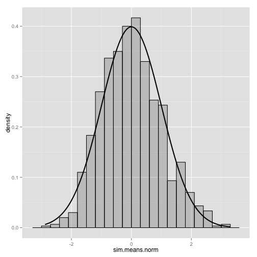

Coursera Statistical Inference Project
======================================

Introduction
------------
This is the project for the statistical inference class. In it, we will use simulation to explore inference and do some simple inferential data analysis. The project consists of two parts:

1. Simulation exercises.
2. Basic inferential data analysis.

The exponential distribution can be simulated in R with rexp(n, lambda) where lambda is the rate parameter. The mean of exponential distribution is 1/lambda and the standard deviation is also also 1/lambda. Set lambda = 0.2 for all of the simulations. In this simulation, you will investigate the distribution of averages of 40 exponential(0.2)s. Note that you will need to do a thousand or so simulated averages of 40 exponentials.

Objective
---------
Illustrate via simulation and associated explanatory text the properties of the distribution of the mean of 40 exponential(0.2)s.

The simulation
--------------
The next code runs a thousand simulations of 40 exponential(0.2)s and store the values in a matrix with 1000 columns and 40 rows. Each matrix element corresponds to a value of an exponential(0.2). The vector **sim.means** contains the means of the thousand simulations. We define **dat** as a data.frame of the vector **sim.means**. 


```r
library(ggplot2)
```

```
## Warning: package 'ggplot2' was built under R version 2.15.2
```

```r
## 1000 simulations of the mean of 40 exponentials(0.2)s
sim.vectors <- replicate(1000, rexp(40, 0.2), simplify = "data.frame")
sim.means <- as.vector(colMeans(sim.vectors))

## checks class(sim.means) head(sim.means)

## Plot of the distribution of the means
dat <- as.data.frame(sim.means)
g <- ggplot(dat, aes(x = sim.means)) + geom_histogram(alpha = 0.2, binwidth = 0.3, 
    colour = "black", aes(y = ..density..))
g
```

 

1. Center of the distribution
-----------------------------
### Required
Show where the distribution is centered at and compare it to the theoretical center of the distribution.
### Answer
We know that the theoretical mean is equal to 1/lambda = 1/0.2 = 5. The value of the mean for the distribution of means of our 1000 simulations is equal to:

```r
sapply(dat, mean)
```

```
## sim.means 
##     5.018
```

This value is very close to the theoretical value. So our distribution is centered around the theoretical mean as we expected.

2. Variance of the distribution
-------------------------------
### Required
Show how variable it is and compare it to the theoretical variance of the distribution.

### Answer
To evaluate the variance of the distribution we calculate the standard error of the distribution: 

```r
sapply(dat, sd)
```

```
## sim.means 
##    0.8112
```

And compare this value with the teoretical value for the normal distribution according with the central limit theorem (CLT) given by $latex \frac{\sigma}{\sqrt(40)}$, that in our case is equal to

```r
5/sqrt(40)
```

```
## [1] 0.7906
```

We can see that the theoretical and experimental values are very close.
3. Aproximation to a normal distribution
----------------------------------------
### Required
Show that the distribution is approximately normal.
### Answer
To show that the distribution is approximately normal we're going to represen the standard normal distribution over the normalized simulation data.

```r
## Plot of the distribution of the means
dat <- as.data.frame(sim.means)
# We normalize the simulation data and define the data frame
sim.means.norm <- (sqrt(40)/5) * (sim.means - 5)
dat.norm <- as.data.frame(sim.means.norm)
# Plot of the normalized simulated data. Note that know they are centered
# around zero as expected
g <- ggplot(dat.norm, aes(x = sim.means.norm)) + geom_histogram(alpha = 0.2, 
    binwidth = 0.3, colour = "black", aes(y = ..density..))
# We superimpose the standard normal distribution over our data.
g <- g + stat_function(fun = dnorm, size = 1)
g
```

 


4. Coverage of the confidence interval for 1/lambda
---------------------------------------------------
### Required
Evaluate the coverage of the confidence interval for 1/lambda: $latex (\bar{X}) \pm 1.96 \frac{S}{\sqrt{n}}$.
### Answer

```r
sapply(dat, mean) + c(-1.96, 1.96) * sapply(dat, sd)
```

```
## [1] 3.428 6.608
```

