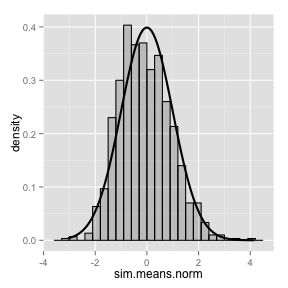

Coursera Statistical Inference Project Part One
===============================================

Introduction
------------
The exponential distribution can be simulated in R with rexp(n, lambda) where lambda is the rate parameter. The mean of exponential distribution is 1/lambda and the standard deviation is also also 1/lambda. Set lambda = 0.2 for all of the simulations. In this simulation, you will investigate the distribution of averages of 40 exponential(0.2)s. Note that you will need to do a thousand or so simulated averages of 40 exponentials.

Objective
---------
Illustrate via simulation and associated explanatory text the properties of the distribution of the mean of 40 exponential(0.2)s.

The simulation
--------------
The next code runs a thousand simulations of 40 exponential(0.2)s and store the values in a matrix with 1000 columns and 40 rows. Each matrix element corresponds to a value of an exponential(0.2). The vector **sim.means** contains the means of the thousand simulations. We define **dat** as a data.frame of the vector **sim.means**. 

```r
## 1000 simulations of the mean of 40 exponentials(0.2)s
sim.vectors <- replicate(1000, rexp(40, 0.2), simplify = "data.frame")
sim.means <- as.vector(colMeans(sim.vectors))
```


```
## Warning: package 'ggplot2' was built under R version 2.15.2
```

 

1. Center of the distribution
-----------------------------
### Required
Show where the distribution is centered at and compare it to the theoretical center of the distribution.
### Answer
We know that the theoretical mean is equal to 1/lambda = 1/0.2 = 5. The value of the mean for the distribution of means of our 1000 simulations is equal to:

```r
sapply(dat, mean)
```

```
## sim.means 
##      4.94
```

This value is very close to the theoretical value. So our distribution is centered around the theoretical mean as we expected.

2. Variance of the distribution
-------------------------------
### Required
Show how variable it is and compare it to the theoretical variance of the distribution.

### Answer
To evaluate the variance of the distribution we calculate the standard error of the distribution: 

```r
sapply(dat, sd)
```

```
## sim.means 
##    0.7829
```

And compare this value with the teoretical value for the normal distribution according with the central limit theorem (CLT) given by $latex \frac{\sigma}{\sqrt(40)}$, that in our case is equal to

```r
5/sqrt(40)
```

```
## [1] 0.7906
```

We can see that the theoretical and experimental values are very close.
3. Aproximation to a normal distribution
----------------------------------------
### Required
Show that the distribution is approximately normal.
### Answer
To show that the distribution is approximately normal we're going to represen the standard normal distribution over the normalized simulation data.
 


4. Coverage of the confidence interval for 1/lambda
---------------------------------------------------
### Required
Evaluate the coverage of the confidence interval for 1/lambda: $latex (\bar{X}) \pm 1.96 \frac{S}{\sqrt{n}}$.
### Answer

```r
sapply(dat, mean) + c(-1.96, 1.96) * sapply(dat, sd)
```

```
## [1] 3.406 6.475
```

