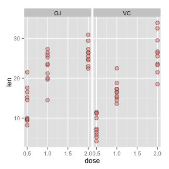

Coursera Statistical Inference Project Part Two
===============================================

Introduction
------------
In the second part of the assignment we're going to analyze the ToothGrowth data in the R datasets package. 

The dataset ToothGrowth
-----------------------
The response is the length of odontoblasts (teeth) in each of 10 guinea pigs at each of three dose levels of Vitamin C (0.5, 1, and 2 mg) with each of two delivery methods (orange juice or ascorbic acid).

Exploratory data analysis
-------------------------
We're going to represent the teeth lenght versus the dose of Vitamin for the two delivery methods.

```
## Warning: package 'ggplot2' was built under R version 2.15.2
```

 

The first thing that we can see is that it looks like, for both delivery methods, with more dose of Vitamin we achieve longer teeth. It looks like the OJ supplement type is more effective than the VC type, however the difference is less clear for the highest dose.

We can see accentuate the difference in the delivery method regardless of the dose with a boxplot.
 


Basic summary of the data
-------------------------
We're going to extract the mean and standard deviations for the six differents groups that we find in our data.


dose/type  |0.5 OJ|0.5 VC|1.0 OJ|1.0 VC|2.0 OJ|2.0 VC
-----------|------|------|------|------|------|------
mean length|13.23 |7.98  |22.70 |16.77 |26.06 |26.14 
lenght sd  |4.46  |2.75  |3.91  |2.51  |2.66  |4.80 

That confirms what we show in the graphical representation of the data.

Using confidence intervals and hypothesis tests to compare tooth growth 
-----------------------------------------------------------------------
Know we're going to use confidence intervals and hypothesis tests to compare tooth growth. 

### Tooth growth by the two delivery methods
Is there a difference in the teeth grow by the method of administration regardless of the dose? We're going to check it using a paired t-test.

```r
g1 <- ToothGrowth$len[1:30]
g2 <- ToothGrowth$len[31:60]
t.test(g2, g1, paired = TRUE)
```

```
## 
## 	Paired t-test
## 
## data:  g2 and g1 
## t = 3.303, df = 29, p-value = 0.00255
## alternative hypothesis: true difference in means is not equal to 0 
## 95 percent confidence interval:
##  1.409 5.991 
## sample estimates:
## mean of the differences 
##                     3.7
```

So it is clear that we can reject the null hypothesis (equal medians of the two delivering methods) and affirm the difference the delivery methods being the OJ method the more efficient.

### Tooth growth by dose for the two delivery methods
#### VC method
We check the differences between the means of the three different dosis.

```r
# Definition of the groups
g1.d05 <- ToothGrowth$len[1:10]
g1.d10 <- ToothGrowth$len[11:20]
g1.d20 <- ToothGrowth$len[21:30]
# Difference between the 1.0 mg and 0.5 mg dose
t.test(g1.d10, g1.d05, paired = TRUE)
```

```
## 
## 	Paired t-test
## 
## data:  g1.d10 and g1.d05 
## t = 6.136, df = 9, p-value = 0.0001715
## alternative hypothesis: true difference in means is not equal to 0 
## 95 percent confidence interval:
##   5.55 12.03 
## sample estimates:
## mean of the differences 
##                    8.79
```

```r
# Difference between the 2.0 mg and 1.0 mg dose
t.test(g1.d20, g1.d10, paired = TRUE)
```

```
## 
## 	Paired t-test
## 
## data:  g1.d20 and g1.d10 
## t = 5.346, df = 9, p-value = 0.0004648
## alternative hypothesis: true difference in means is not equal to 0 
## 95 percent confidence interval:
##   5.405 13.335 
## sample estimates:
## mean of the differences 
##                    9.37
```

```r
# Difference between the 2.0 mg and 0.5 mg dose
t.test(g1.d20, g1.d05, paired = TRUE)
```

```
## 
## 	Paired t-test
## 
## data:  g1.d20 and g1.d05 
## t = 9.791, df = 9, p-value = 4.264e-06
## alternative hypothesis: true difference in means is not equal to 0 
## 95 percent confidence interval:
##  13.96 22.36 
## sample estimates:
## mean of the differences 
##                   18.16
```

In all the cases we see that according with the t-test there exists differences in the length gown of the teeth reaching longest longitude with greater Vitamin C dose.

#### OJ method
We check the differences between the means of the three different dosis.

```r
# Definition of the groups
g2.d05 <- ToothGrowth$len[31:40]
g2.d10 <- ToothGrowth$len[41:50]
g2.d20 <- ToothGrowth$len[51:60]
# Difference between the 1.0 mg and 0.5 mg dose
t.test(g2.d10, g2.d05, paired = TRUE)
```

```
## 
## 	Paired t-test
## 
## data:  g2.d10 and g2.d05 
## t = 4.163, df = 9, p-value = 0.002435
## alternative hypothesis: true difference in means is not equal to 0 
## 95 percent confidence interval:
##   4.325 14.615 
## sample estimates:
## mean of the differences 
##                    9.47
```

```r
# Difference between the 2.0 mg and 1.0 mg dose
t.test(g2.d20, g2.d10, paired = TRUE)
```

```
## 
## 	Paired t-test
## 
## data:  g2.d20 and g2.d10 
## t = 1.944, df = 9, p-value = 0.08384
## alternative hypothesis: true difference in means is not equal to 0 
## 95 percent confidence interval:
##  -0.5509  7.2709 
## sample estimates:
## mean of the differences 
##                    3.36
```

```r
# Difference between the 2.0 mg and 0.5 mg dose
t.test(g2.d20, g2.d05, paired = TRUE)
```

```
## 
## 	Paired t-test
## 
## data:  g2.d20 and g2.d05 
## t = 7.492, df = 9, p-value = 3.724e-05
## alternative hypothesis: true difference in means is not equal to 0 
## 95 percent confidence interval:
##   8.956 16.704 
## sample estimates:
## mean of the differences 
##                   12.83
```

In all the cases we see that according with the t-test there exists differences in the length gown of the teeth reaching longest longitude with greater Vitamin C dose.
#### One last case: 2.0 mg dose with OJ and VC methods 

```r
t.test(g1.d20, g2.d20, paired = TRUE)
```

```
## 
## 	Paired t-test
## 
## data:  g1.d20 and g2.d20 
## t = 0.0426, df = 9, p-value = 0.967
## alternative hypothesis: true difference in means is not equal to 0 
## 95 percent confidence interval:
##  -4.169  4.329 
## sample estimates:
## mean of the differences 
##                    0.08
```

In this case we can see there is no evidence to discard the null hypothesis.
